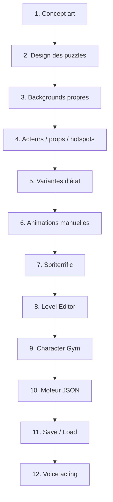

# Workflow — jeu d'aventure point-and-click avec IA

Note de référence basée sur la vidéo [Create a Monkey Island Game with AI](https://www.youtube.com/watch?v=3sg2aHYAruw) de **Chong-U — AI Oriented Dev** (27 min, juin 2026).

Objectif : construire un jeu d'aventure **point-and-click** complet (style Monkey Island / Sam & Max) — art, animations, puzzles, voix, moteur jouable dans le navigateur — en s'appuyant sur l'IA à chaque étape.

---

## Stack globale

| Domaine | Outil / IA |
|---------|------------|
| Art statique & édition d'image | GPT Image 2.0, NanoBanana 2 |
| Sprites & animations | **Spriterrific** (Grok Imagine en image-to-video) |
| Voix, musique, SFX | ElevenLabs |
| Splash / boucle d'intro | Grok Imagine |
| Moteur de jeu | Phaser 4 + TypeScript |
| Code & architecture | Claude Opus 4.8, Claude Fable 5, Codex, Cursor |

---

## Vue d'ensemble des 12 étapes



| Étape | Chapitre vidéo | Tâche principale |
|-------|----------------|------------------|
| 1 | 03:15 | Mockups / concept art |
| 2 | 05:23 | Story, puzzles, annotations |
| 3 | 07:21 | Séparation des backgrounds |
| 4 | 08:48 | Extraction acteurs, props, hotspots |
| 5 | 09:42 | Variantes d'état des objets |
| 6 | 11:57 | Animations (pipeline manuel) |
| 7 | 15:27 | Automatisation via Spriterrific |
| 8 | 19:30 | Level Editor |
| 9 | 21:24 | Character Gym |
| 10 | 22:07 | Moteur de puzzles JSON |
| 11 | 24:26 | Sauvegarde / chargement |
| 12 | 25:24 | Voice acting |

---

## IA utilisée à chaque étape

| Étape | IA / outil | Rôle |
|-------|------------|------|
| **1** — Concept art | IA image (modèle non nommé) | 4 candidats par round, itération par prompts |
| **2** — Puzzles | Claude (Codex / Opus) | Story, puzzle flow, flags, annotation des hotspots |
| **3** — Backgrounds | **GPT Image 2.0** (préféré) ou NanoBanana 2 | Retirer perso, props ramassables, UI |
| **4** — Atlas chroma | IA image (édition / génération) | Bounding boxes → atlas unique sur fond vert → découpe |
| **5** — États | **GPT Image 2.0** ou NanoBanana 2 | Variantes cohérentes (tiroir ouvert/fermé, etc.) |
| **6** — Animations manuelles | **Grok Imagine** + option Pixel Snapper | Image-to-video ~1 s, extraction de frames |
| **7** — Spriterrific | **Spriterrific** + Grok Imagine | Anchor, cycles (`idle`, `walk`, `talk`…), export spritesheet |
| **8** — Level Editor | Claude Opus 4.8, Codex, Cursor | Navmesh, hotspots, placement d'acteurs (Phaser 4) |
| **9** — Character Gym | Même stack que l'étape 8 | Prévisualisation, origin point |
| **10** — Moteur JSON | **Claude Opus 4.8** + **Claude Fable 5** | Architecture data-driven (inspirée SCUM / LucasArts) |
| **11** — Save / Load | — | Snapshot JSON de l'état du jeu |
| **12** — Voix | **ElevenLabs** (`npx skills@elevenlabs skills`) | Génération et branchement audio depuis le JSON |

> **Précision** : aux étapes 1 et 4, la vidéo parle d'« IA image » sans toujours nommer le modèle exact. Les étapes 3, 5 et 6 citent explicitement GPT Image 2.0 et Grok Imagine.

---

## Détail par étape

### 1 — Concept art (funnel)

1. Générer **4 candidats** de mockup par round.
2. Itérer : réduire le bruit visuel, augmenter l'**espace de marche**, clarifier les **hotspots**.
3. Choisir un style **jouable**, pas seulement esthétique.
4. Funnel : brainstorm → réduire → affiner → thème validé.

**Livrable** : mockup de référence pour la story et les assets.

---

### 2 — Design des puzzles

1. Donner le mockup à l'IA (Claude).
2. Demander une histoire + puzzles sur **plusieurs scènes**.
3. Faire **annoter** chaque scène : hotspots, objets interactifs, acteurs.
4. Produire un **puzzle flow** avec des **flags** booléens (états qui débloquent la progression).

**Attention** : l'IA peut générer des puzzles « moon logic » (logique absurde) — relire et corriger le design avant l'implémentation.

**Livrable** : document de design (Markdown) + liste d'interactables par scène.

---

### 3 — Backgrounds propres

1. À partir du concept art, retirer : personnage, UI, props ramassables, personnages.
2. Prompt type : *« Remove all main actors and hotspots, keep everything else the same. »*
3. Obtenir une **pièce vide** réutilisable comme fond de scène.

**IA** : GPT Image 2.0 (préféré dans la vidéo).

---

### 4 — Acteurs, props et hotspots

1. Encadrer (bounding boxes) les acteurs et hotspots clés.
2. Générer un **atlas unique** sur fond **chroma** (vert) : tous les props dans le même style.
3. Découper l'atlas → assets individuels à fond transparent.
4. Les props superposés sur le background peuvent disparaître de la scène une fois ramassés.

**Livrable** : sprites isolés prêts pour le moteur et Spriterrific.

---

### 5 — Variantes d'état

Pour chaque objet à plusieurs états (tiroir, boîte, machine…) :

1. Utiliser l'objet comme **image de référence**.
2. Générer les variantes en préservant la cohérence visuelle.
3. Superposer la bonne variante dans l'éditeur selon l'état du jeu.

**IA** : GPT Image 2.0 ou NanoBanana 2.

---

### 6 — Animations (pipeline manuel)

1. Image de référence en **1024×1024**.
2. Optionnel : **Pixel Snapper** pour du pixel art propre.
3. Générer une **pose canonique** (facing).
4. Préférer **image-to-video** (Grok Imagine, ~1 seconde) plutôt qu'une sprite sheet frame par frame.
5. Extraire les frames → éviter le *frame bleeding* et les tailles incohérentes.

**Livrable** : cycles d'animation bruts avant passage dans Spriterrific.

---

### 7 — Spriterrific (automatisation)

1. Passer l'image source (étape 4) dans **Spriterrific**.
2. Choisir le mode **point-and-click** → anchor en vue **3/4** (pas profil complet).
3. Demander les animations : `idle`, `walk`, `talk`, `interact`, `pick up`, `use`, `examine`, `give`, etc.
4. Même technique pour les props animés (ex. machine à popcorn).
5. Utiliser le **frame picker** pour curater les frames.
6. Exporter les **spritesheets** pour Phaser.

Voir aussi : [Pipeline marche / vidéo](walk-cycle-video-pipeline.md), [Guide opérateur](operator-guide.md), [Lancer le logiciel](lancement.md).

---

### 8 — Level Editor

Éditeur navigateur avec :

- **Navmesh** — zones marchables ;
- **Hotspots** — zones d'interaction (`look`, `do`) ;
- **Interaction spots** — point où le personnage se place avant l'animation (alignement avec le hotspot) ;
- **Placement d'acteurs** — props superposés, édition live ;
- **Vues debug** — navmesh, hotspots, bounds.

**Stack** : Phaser 4 + TypeScript, code assisté par Claude / Codex dans Cursor.

---

### 9 — Character Gym

- Prévisualiser toutes les animations du personnage.
- Ajuster l'**origin point** (crucial en point-and-click).
- Vérifier l'alignement walk / talk / interact avec les hotspots.

---

### 10 — Moteur de puzzles JSON

Inspiré de **SCUM** (outil LucasArts, Manic Mansion) :

- Tout le jeu dans **un fichier JSON** : scènes, navmesh, hotspots, acteurs, dialogues, flags.
- **2 verbes** : `look` et `do`.
- Règles **when → do** pour les effets et la progression.
- **Porte finale** qui valide la fin du jeu.
- Pas de recompilation : modifier le JSON = modifier le contenu.
- L'IA peut écrire ou modifier le JSON directement.

**IA** : Claude Opus 4.8 et Claude Fable 5 pour l'architecture du moteur.

---

### 11 — Save / Load

- Le JSON sert aussi de **fichier de sauvegarde** (snapshot d'état).
- Inventaire, états des objets, flags → tout persiste au rechargement.

Pas d'IA dédiée : mécanisme intégré au moteur data-driven.

---

### 12 — Voice acting

```bash
npx skills@elevenlabs skills
```

Dans Cursor (ou autre éditeur) :

1. Installer le skill ElevenLabs.
2. Demander : *« Add voice acting to my entire game »*.
3. Le skill lit le JSON, génère les lignes via ElevenLabs, branche les fichiers audio.
4. Relancer le skill après chaque modification de dialogue.

Voir aussi : [Clés API et services IA](cles-api.md) pour la configuration ElevenLabs.

---

## Résumé input / output

| Phase | Input | Output |
|-------|-------|--------|
| Concept | Idées + prompts IA | Mockup validé + story |
| Design | Mockup | Puzzle flow + flags + annotations |
| Assets | Concept art | Backgrounds, props, atlas, états |
| Animation | Images sources | Spritesheets (Spriterrific) |
| Engine | JSON + assets | Jeu jouable dans le navigateur |
| Polish | JSON dialogues | Voix, musique, SFX (ElevenLabs) |

**Temps indicatif (vidéo)** : environ une journée pour le gros du travail, puis polish.

---

## Lien avec ce dépôt (Spriterrific MadHackademie)

Ce workflow couvre un jeu complet ; **Spriterrific** intervient principalement aux **étapes 6–7** (animations personnages et props). Le reste (Phaser, JSON, ElevenLabs, édition d'image GPT) se fait en dehors de ce repo.

| Besoin | Document local |
|--------|----------------|
| Lancer Spriterrific | [lancement.md](lancement.md) |
| Clés API (fal.ai, etc.) | [cles-api.md](cles-api.md) |
| Pipeline vidéo / marche | [walk-cycle-video-pipeline.md](walk-cycle-video-pipeline.md) |
| Tutoriel personnage | [tutoriel.md](tutoriel.md) |
| Skill agent pour Cursor | [SKILL.md](../src/spriterrific/skills/spriterrific/SKILL.md) |

---

## Ressources

- [Vidéo source (YouTube)](https://www.youtube.com/watch?v=3sg2aHYAruw)
- [Spriterrific (site)](https://spriterrific.com)
- [VibeGameDev — communauté du créateur](https://aiod.dev/9r7)
